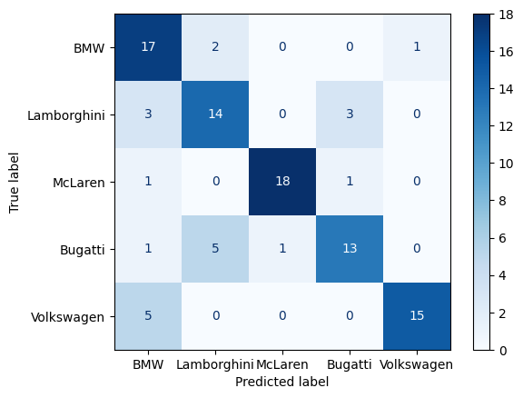
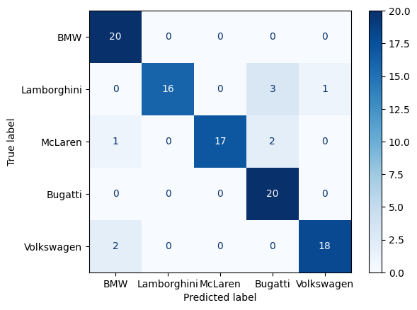

# Car_Brand_Classification_Using_VGG16
 Modifying the pre-trained VGG16 CNN for car brand classification.

# Problem Statement
 The VGG16 model is relatively large and tends to overfit when working with a small sample size. Utilizing accuracy as the evaluation metric leads to fluctuations in validation accuracy, thereby diminishing the robustness of the model.
 
# Methodology 
## 1. Unfreezing the last convolutional block of the VGG16
    To fine-tune the VGG16 model for optimal classification of car brands, it is crucial to train the last convolutional block and update the weights of each node during each epoch.
## 2. Add in L2 Regularization term
    Unfreezing the convolutional block has the tendency to overfit the data, resulting in a better fit to the training data but a failure to converge for the test data. An L2 regularization term is added here to mitigate overfitting.
## 3. Optimize the other parameters
    Optimize parameters, including the learning rate and number of epochs, and switch to F1 evaluation metrics to achieve improved results.
    
# Conclusion
 We can observe significant improvements in the confusion metrics below after modifying the VGG16 CNN.

## Before:
 
 

## After:
 
 

